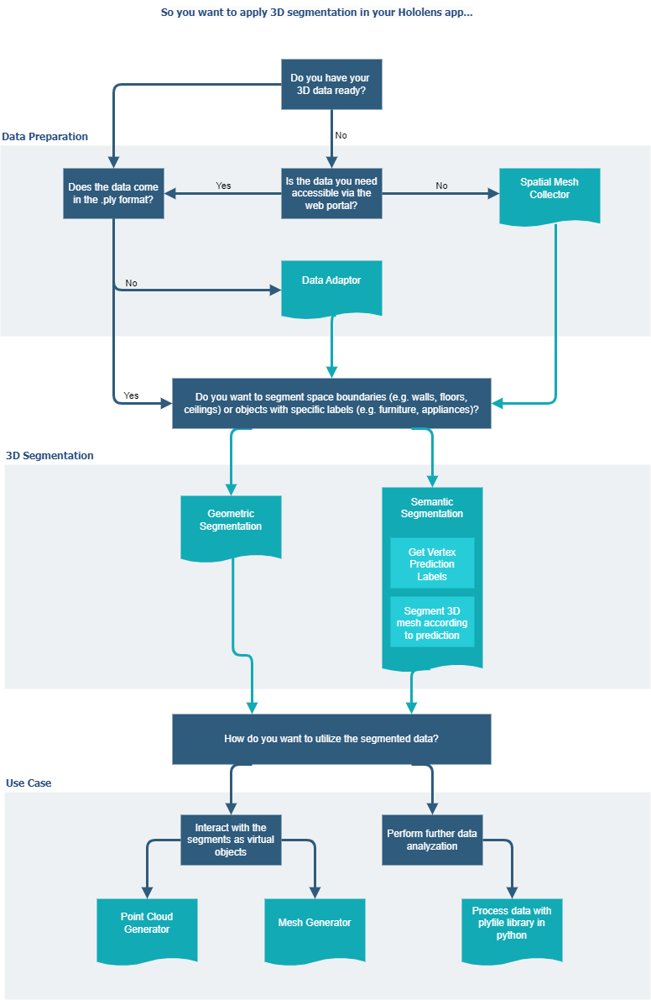

# VisionARy: An Open Source 3D Environment Segmentation Toolkit for Augmented Reality


VisionARy is an open-source toolkit designed to make 3D indoor segmentation technologies accessible to Augmented Reality (AR) developers and researchers. With a strong emphasis on developer experience, the toolkit expands the potential of AR spatial mesh in conjunction with 3D segmentation, providing various modules for geometric and semantic segmentation, data adaptation, AR platform integration, and APIs.

[[video](https://www.youtube.com/playlist?list=PLrYVDrNwUVZA4m67fYLc22FMmgH0v85ib)]
## Getting Started
### Download the Toolkit
```commandline
git clone https://github.com/yuechenw213/VisionARy.git
```
### Get Your Developer Roadmap


#### Prepare your data
- If you already have 3D mesh data that you want to segment, make sure it is in .ply file format. If not, you will need to convert it to this format.
- You can also obtain a spatial mesh from the Hololens web portal, which will be in .obj file format. To use this mesh for segmentation, you will need to convert it to .ply format. The Data Adaptor module can assist you in converting the data.
- If the data is not still available, you can use the Spatial Mesh Collector module to collect spatial mesh data in real-time. To do this, deploy a Unity app with the provided package to the Hololens device, and set up the Python server provided in the module. The app will send the captured mesh data to the backend, where it will be saved as a .ply file.
#### Perform 3D segmentation
- To perform 3D segmentation, first determine what you want to segment from the data.
- Geometric segmentation involves segmenting based on the geometry and topology of the 3D mesh. This approach is useful for segmenting space boundaries and other geometric features.
- Semantic segmentation involves segmenting based on the labels or categories of objects in the 3D mesh. This approach is useful for segmenting specific types of objects (e.g. furniture) or features (e.g. windows, doors).
- Follow the instructions provided in the module to perform the segmentation.
#### Apply Segmentation Result to Your Application
- The segmented result is provided in the form of multiple .ply files, each representing a segment of the 3D mesh.
- If further data processing is needed, you can use the Python code and the plyfile library to access the features of the segmented data.
- To apply segmentation to your AR application, modules are provided in the toolkit to load the segmented result into the Unity engine. The segmented data can be loaded as a mesh object or point cloud, depending on the specific needs of your application.
The module also provides a batch loading function for loading multiple segments at once.
## Modules
### Spatial Mesh Collector
This module is designed to facilitate the collection of 3D mesh data from real-world environments. 
The module provides runtime data collection Unity package and a local TCP server.
#### Python Server
The Python server receives data from the Hololens client and saves it locally in .ply format. It acts as a bridge between the client and backend processing tools, allowing for real-time data capture and processing.

##### Setup:
- In [./SpatialMeshCollector/server.py](./SpatialMeshCollector/server.py), set the `HOST` constant to your local ip address. Set the `output` constant to your designated filepath.
- Run `./SpatialMeshCollector/server.py` to start receiving connections.
- When the 3D spatial data is received and saved, the server will stop automatically.

#### Unity Package
##### Setup:
- In a unity project, use `Assets > Import Package > Custom Package` to import the [VisionARy_MeshCollector.unitypackage](./SpatialMeshCollector/UnityExample/VisionARy_MeshCollector.unitypackage) for collecting and sending 3D spatial mesh.

- Then in the `Project` window, under `Asset > Scenes`, open the `MeshCollect.unity` scene.

### Data Adaptor
### Geometric Segmentation
### Semantic Segmentation

```commandline
python .\segment_via_HTTP.py --mesh_file=D:/thesis/ac
cessability/test_docs/spatialMappingWithRGB.ply --output_folder=D:/thesis/accessability/
test_docs/output_folder/
```
```commandline
python .\semantics_to_mesh.py --pred_zip .\20230414_192339_room.zip --mesh_file .\test_docs\spatialMappingWithRGB.ply --output_folder .\test_docs\out
put_folder
```

```commandline
python .\visualize_labels_on_mesh.py --pred_file .\test_docs\20230414_192339_room\pred_mask\20230414_192339_room_2.txt --mesh_file .\test_docs\spatia
lMappingWithRGB.ply --output_file .\test_docs\output2.ply
```

### Segmented Mesh Generator

### Point Cloud Generator


